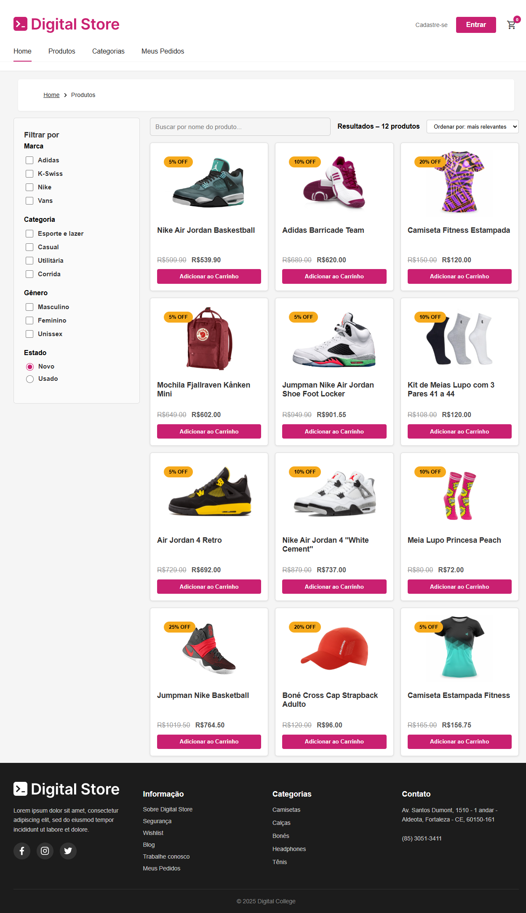
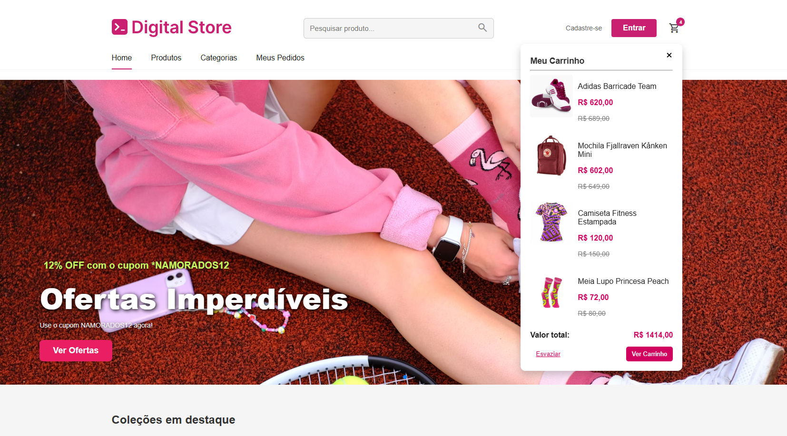
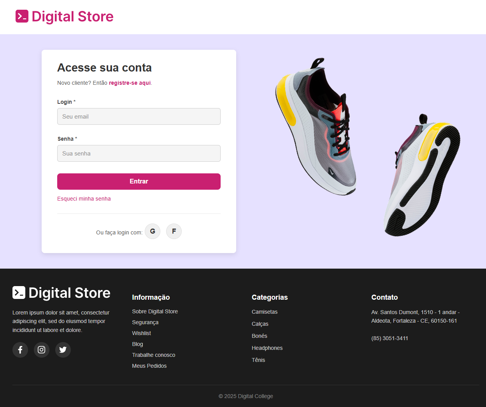

# 🛍️ Digital Store | E-Commerce

Projeto de e-commerce desenvolvido como trabalho final do curso de Desenvolvedor Full Stack. A proposta é construir uma loja virtual funcional, com foco em experiência do usuário, estruturação clara e boas práticas de desenvolvimento web.

---

## 🎯 Objetivo do Projeto

Este projeto tem como objetivo oferecer uma loja virtual funcional que permita aos usuários realizar as seguintes ações:

- Visualizar produtos por coleção
- Pesquisar produtos com filtros simples
- Adicionar produtos ao carrinho
- Visualizar pedidos no carrinho através de um modal
- Acessar uma lista de pedidos realizados
- Realizar login para acesso aos pedidos

---

## 🚀 Tecnologias e Ferramentas Utilizadas

### 🧱 Front-End
- **HTML5**  
- **CSS3** *(com CSS Modules para estilização isolada)*
- **JavaScript (ES6+)**
- **React**  
  - Uso de componentes reutilizáveis  
  - Estrutura modularizada por páginas
- **Lucide React** *(ícones)*
- **Modal com carrinho de compras*  
- **React Router** *(navegação entre páginas)*

### 🧰 Back-End e Deploy
- **Supabase** *(banco de dados e autenticação)*
- **Vercel** *(deploy e preview online)*
- **Vite** *(build tool leve para projetos em React)*

---

## 🧩 Estrutura da Aplicação

```plaintext
/public
  index.html
  /assets
    home.png
    search.png
    cart-modal.png
    login.png

/src
  /components
    Header.jsx
    Footer.jsx
    ProductCard.jsx
    ModalCart.jsx
    ...
  /pages
    Home.jsx
    Search.jsx
    Cart.jsx
    Orders.jsx
    Login.jsx
  main.js
  App.jsx
README.md
```

---

## 🧪 Funcionalidades Implementadas

- [x] Slide rotativo com imagem destaque  
- [x] Ícones de navegação por coleções  
- [x] Grade de produtos  
- [x] Modal com visualização do carrinho  
- [x] Página de busca com filtros simples  
- [x] Página com lista de pedidos  
- [x] Tela de login integrada ao Supabase  

---

## 📸 Preview da Aplicação

| Página Inicial          | Página de Busca            |
|------------------------|---------------------------|
|  |  |

| Modal do Carrinho       | Tela de Login              |
|------------------------|---------------------------|
|  |  |

> As imagens acima mostram as telas principais da aplicação, ilustrando a interface e funcionalidades em ação.

---

## 🎨 Protótipo de Design (Figma)

O layout da aplicação foi planejado com base em um protótipo visual, para guiar a estrutura e identidade do projeto.

🔗 [Visualizar protótipo no Figma](https://www.figma.com/design/Tk1Wc4vTNMCZDWkIwAQTxC/DRIP-STORE---DIGITAL-COLLEGE?node-id=101-2&p=f&t=4J3ScYI7KD59Is8L-0)

> *Nota: O design final pode conter adaptações feitas durante o desenvolvimento para melhor responsividade e usabilidade.*

---

## 🔑 Acesso ao Backend (Supabase)

> A banca pode acessar o Supabase para análise do backend, incluindo visualização de tabelas, autenticação e armazenamento.

- 🔗 **URL do Supabase:** [https://app.supabase.com/](https://supabase.com/dashboard/project/pdevuhebbhawqsosrmhi)
- 📧 **Email:** `digitalstore.supabase@gmail.com`
- 🔐 **Senha:** `Drip@supabase10`

✅ *Permissão de acesso para análise das tabelas, dados de usuários, pedidos e produtos utilizados neste projeto.*

---

## 👥 Usuário de Teste (Frontend)

> Utilize este usuário para testar o fluxo de login, carrinho e pedidos no site.

- 📧 **Email:** `fco.ant.pereira@email.com`
- 🔐 **Senha:** `123456`

✔️ Esse usuário foi criado exclusivamente para testes da banca, permitindo navegar nas áreas restritas e testar as funcionalidades de pedidos, carrinho e autenticação.

---

## 📝 Observações

- O backend foi desenvolvido utilizando o **Supabase**, que oferece serviços de:
  - Banco de dados PostgreSQL  
  - Autenticação de usuários  
  - API RESTful automática  
  - Armazenamento de arquivos (Storage)

- Toda comunicação do frontend com o backend é feita via API do Supabase.

---

## 🌐 Deploy Online

🔗 [Acesse o projeto no Vercel](https://vercel.com/drih1502-gmailcoms-projects/projeto-final-e-commerce)

---

## 🏃‍♂️ Como rodar localmente

Se desejar rodar o projeto localmente, siga os passos abaixo:

```bash
git clone https://github.com/drihcs/Projeto-final-e-commerce.git
cd projeto-final-e-commerce
npm install
npm run dev
```

---

## 👥 Equipe de Desenvolvimento

| Nome           | GitHub                                         |
|----------------|------------------------------------------------|
| Adriana Cruz   | [@drihcs](https://github.com/drihcs)          |
| Letícia Farias | [@leticiafariasn](https://github.com/leticiafariasn) |
| Sara Morais    | [@sarasmorais](https://github.com/sarasmorais) |

---

## ✨ Próximos Passos

1. Finalizar páginas da rota privada de usuário.  
2. Finalizar autenticação de usuários com redirecionamentos.  
3. Tornar o layout responsivo para dispositivos móveis.  
4. Aperfeiçoar detalhes na página de detalhes dos produtos.  
5. Otimização e testes.

---
